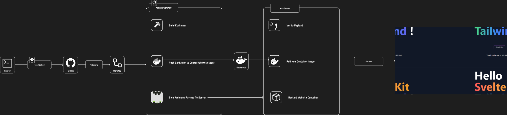

# Project 5 - Continuous Development

### Overview

This time we are stumbling upon CI's best friend, CD, continuous development. They're often paired together to make a company codebase easier to maintain since developers don't have to manage all of the building, and redeploying.  

The purpose of Continuous Development is to automate the building, redeploying process, and everything in between. From Pushing it into version control, trigger workflows, to pulling production builds, taking down the old build and deploying the new production. 

Tools:
- Github Actions (Workflow)
- Docker Containers
- Webhook
- Bash (Scripting)
- Linux Systemctl service (Service provider)





## Part 1 - Semver

First learning how to create tags in git. It's as simple as:

```bash
git tag <version>
```

The tag command will tag the HEAD commit, which is the latest commit. There can only be one tag and deleting them is not encouraged but is possible, mostly for local use.

Using the `-m` flag, we can add a message to our tag giving more context to the tag.

### Actions

This also means I had to change some of the github workflows file to only trigger IF AND ONLY IF a tag has been pushed. This way, if I have multiple commit to push and I'm not finished with my version quite yet, GitHub won't build the unfinished project.

Changing it is as easy as adding `tags` into one of the requirements for the action to execute:
```yml
on:
  push:
    tags:
      - v*
    ...
```

### Metadata and container tags

Then we can also add a step to the job to take the metadata of the commit and add it to the push for dockerhub like so:

```yml
- name: Docker Metadata
        id: meta 
        uses: docker/metadata-action@v5
        with:
          images: joshquaintance/sveltekit-template
          flavor: |
            latest=auto
```
- `id` - tells the rest of the actions that the output of this step will be labeled as meta
- `images` - the dockerhub container repository name
- `flavor: latest=auto` - this makes it so that the latest tag in dockerhub will be linked to the latest tag pushed.

Then adding one line to the "Build and Push" step
```yaml
tags: ${{ steps.meta.outputs.tags }}
```

Here is the link to the dockerhub repo:
https://hub.docker.com/repository/docker/joshquaintance/sveltekit-template/general


## Part 2 - Deployment

### Installing docker

Installing docker on the EC2 instance was quite simple. Just go to https://docs.docker.com/engine/install/ubuntu/ and follow the instruction.

There were a few scripts there to remove any docker installation just in case there was one lingering

Then a few more commands:
```bash
# Straight copied from the link
# This just adds GPG keys to verify the integrity of the docker installation and adding the repository to apt (assuming apt don't always have the latest version of docker maybe?)
# Add Docker's official GPG key:
sudo apt-get update
sudo apt-get install ca-certificates curl gnupg
sudo install -m 0755 -d /etc/apt/keyrings
curl -fsSL https://download.docker.com/linux/ubuntu/gpg | sudo gpg --dearmor -o /etc/apt/keyrings/docker.gpg
sudo chmod a+r /etc/apt/keyrings/docker.gpg

# Add the repository to Apt sources:
echo \
  "deb [arch=$(dpkg --print-architecture) signed-by=/etc/apt/keyrings/docker.gpg] https://download.docker.com/linux/ubuntu \
  $(. /etc/os-release && echo "$VERSION_CODENAME") stable" | \
  sudo tee /etc/apt/sources.list.d/docker.list > /dev/null
sudo apt-get update
```

Then it's as simple as installing docker and it's dependencies
```bash
sudo apt-get install docker-ce docker-ce-cli containerd.io docker-buildx-plugin docker-compose-plugin
```

Then tested with a simple hello world
```bash
sudo docker run hello-world
```

### Deployment Script

The script is really simple, it only contains 3 lines.

1. First command is to stop a running container that contained the same website, just in case.
2. Then it pulls the latest image from dockerhub, since latest will always be the newest tag
3. Re-started the container in the background

It should be located inside of `ubuntu`'s home directory, (technically it would've been better to put on a shared directory like /var or /usr/share, but this works fine as well)

### Webhook

Installing webhook is as simple as:
```
sudo apt-get webhook
```

Then I created `hooks.json` in my home directory. Int it is the configuration for my webhook, pointing it to run the `redeploy.sh` script also in the home directory.  
I also went a step ahead and added a requirement to have a secret be sent to the payload that is hashed using sha1. This ensures that there won't be any random person/script can just send a payload and trigger a redeploy.

To start the webhook, simply run:
```bash
sudo webhook -hooks /home/ubuntu/hooks.json
```

This will create a webhook listener that listens on port `9000` and listen on a specific http url: `aws.ip.address:9000/hooks/redeploy-hook`

Also, I created a `web-container-hook.service` file that contains a command that will run the webhook service using systemctl, so as soon as the server starts, the webhook will also run. It also checks to make sure that it only runs after the `webhook.service` has already started, because it relies on that service to start (maybe? just in case anyways)

### Inside of the `hooks.json`
```json
[{
  "id": "redeploy-hook",
  "execute-command": "/home/ubuntu/redeploy.sh",	
  "command-working-directory": "/home/ubuntu",
  "response-message": "redeploying service", 

  
  "trigger-rule": {
    "match": {
      "type": "payload-hmac-sha1",
      "secret": "very-safe-secret",
      "parameter": {
        "source": "header",
        "name": "X-Hub-Signature"
      }	
    }
  }
}]
```
- `id` - This is the id of the webhook, it will determine the url for the payload listener
- `execute-command` - the command that will be ran when the webhook is triggered
- `command-working-directory` - the working directory when the redeploy script is ran
- `response-message` - a simple message to send back after execution
- `trigger-rule` - A trigger rule to fulfill before running the webhook
- The first `match` - It simply checks if there is a parameter in the payload named `X-Hub-Signature` (which GitHub will send), and it contains the hashed text for the very totaly safe secret with the a salt

### Configure GitHub to send webhook payload

For this task, I used a different action than the one used for lecture, I used `distributhor/workflow-webhook@v3` instead, since I have worked with the action template before.

I simply added another step to the job that uses the action template:

```yml
- name: Send Deployment Webhook
        uses: distributhor/workflow-webhook@v3
        with:
          webhook_auth_type: "header"
          webhook_url: "${{ secrets.WEBHOOK_URL }}"
          webhook_secret: "${{ secrets.WEBHOOK_SECRET }}"
```
Explanation:
- `webhoook_auth_type` - is the auth type used to send to the payload, in this case I need it to be a header auth since the webhook listens for that `X-Hub-Signature` header. 
- `webhook_url` - is the url where this step will send a payload to
- `webhook_secret` - is the totally secure secret that will be hashed and sent with the payload as a header inside of the `X-Hub-Signature`. This is an important part of the payload since the webhook will reject the payload if it doesn't have the proper secure secret.