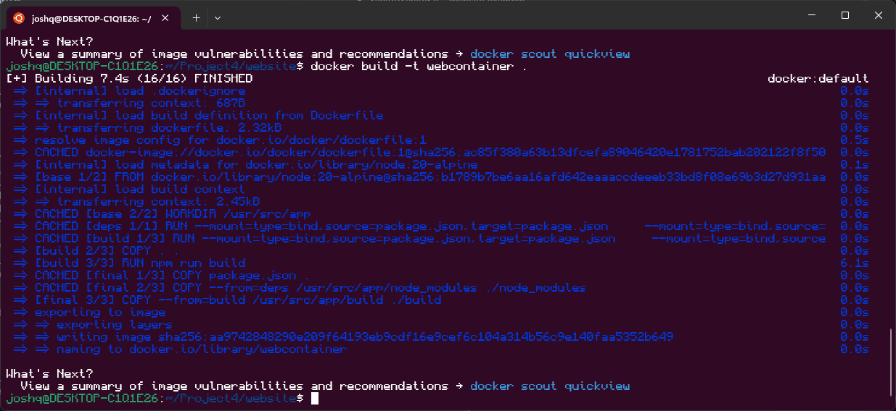

### Project Overview

This project shows how continuous integration works, which is the standard in today's development world. The idea is that after an update to the code base and building the project, the container will automatically be able to run the code at any environment without the developer having to change any container configurations, thus the continuous nature. 

##### Tools Used:
 - Docker - Container software
 - Docker Hub - Repos of existing containers
 - Node.js - Runner (The thing that will run the website)
 - Svelte/SvelteKit - Website example

# TODO: DIAGRAM


### Running Locally

In order to run this project locally, you need a docker installation. This image was created using Windows Docker inside of WSL.

#### 1. Installing Docker

The simplest way to install docker on windows is to download [Docker Desktop](https://docs.docker.com/desktop/install/windows-install/). By clicking that link, we can simply download the installer. When running the installer, it will prompt to use what kind of backend. I used the WSL2 backend, since most of the development for this project was done using WSL2. After docker has done installing, simply log out of your computer and log back in.

To confirm that docker is successfully installed, you can either run a simple `hello-world` container, or in WSL2, simply run the `docker -v` to ensure the installation. If it is properly installed, it should return something similar to:
```
Docker version 24.0.6, build ed223bc
```

#### 2. Building 

After docker is installed, go inside the `website/` folder. This folder contains everything needed for the website and the docker images. 

_DISCLAIMER: I did use a docker template for node js, but I made sure I understood what it is doing, which isn't really that complicated._

The Dockerfile is located inside of the `website/` folder to make it easier, since the website has to go through a build process

To build the docker container, simply run this command:
```bash
docker build -t webcontainer .
# The webcontainer is simply a tag that can be changed to your desire
# This tag will be used to run the command
```

If ran properly, the output should look somewhat like below:



#### 3. Running the Container

To run the container, take note of the tag that was used on the building process, in this example case, our tag is `webcontainer`. Then we simply run this command:
```bash
docker run -it -p 80:80 --rm --name my-cool-website webcontainer
```

This command will look for the container that was built and running it inside an interactive shell (which won't be very interactive since it will be running the server). 

If everything went well, the command should output something similar to this:
```bash
> sveltekit-template@0.0.1 start
> PORT=80 node build/

Listening on 0.0.0.0:80
```

Then it will be listening for any activity. You won't be able to type anything or do anything but don't worry, the web server should be running. 

If you want to end it simply press <kbd>CTRL + C</kbd>

#### 4. Viewing Project

To check if the web server actually work, there are multiple ways of doing this.

1. Curling the local ip and port:
    ```
    curl localhost:80
    ```
    And this should return a massive html that contains the website.

2. The better way, test in a browser. Simply open your browser and go to `localhost:80` on the address bar. It should show the website in its glory.